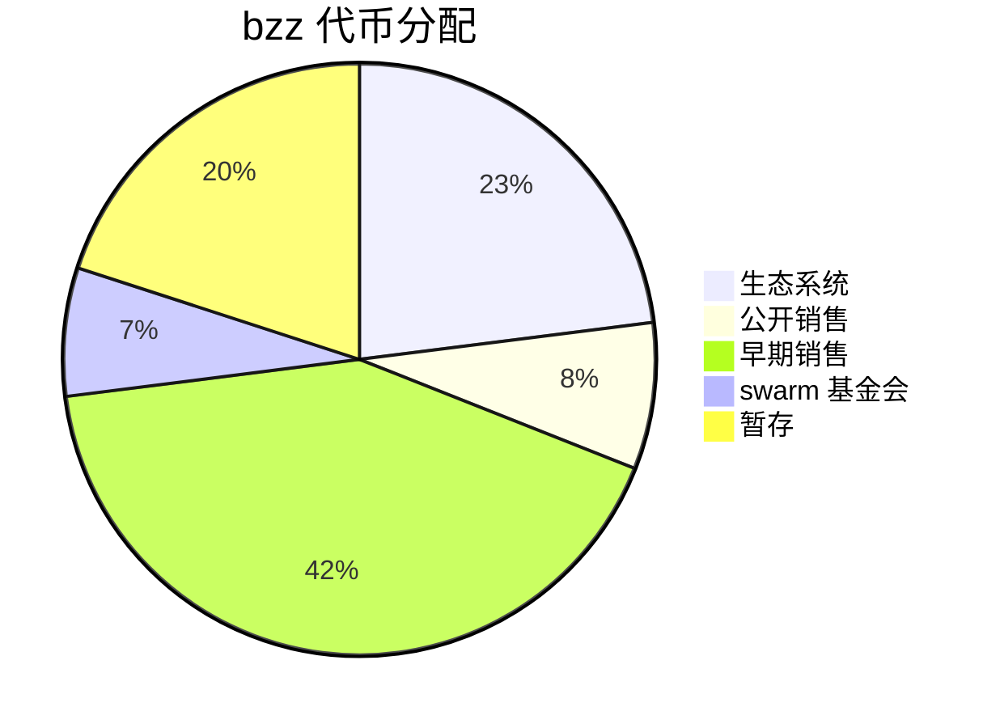

# Swarm

## 简介

Swarm 是一个对等网络节点的系统，创建分散的存储和通信服务。 由于在 Ethereum 区块链上强制执行智能合同的内置激励系统，该系统是经济的自我维持。

- ~~总发行：62,510,000（6251w 枚） bzz~~
- 总发行：66,208,125（≈6620w 枚） bzz
- 私募/预售（种子）：26,000,000（2600w 枚） bzz 41.59%
  - 私募：16,000,000（1600w 枚），价格 0.25💲，募集资金：4,000,000（400w💲）25.6%
  - 种子轮：10,000,000（1000w 枚），价格 0.2💲，募集资金：2,000,000（200w💲）16%
- 公募：500w 枚 bzz，价格 1.9$，募集资金：950w💲 8.28%

## 链接

[cryptorank - swarm](https://cryptorank.io/ico/swarm)

- erc20 合约地址 [0x19062190b1925b5b6689d7073fdfc8c2976ef8cb](https://etherscan.io/token/0x19062190b1925b5b6689d7073fdfc8c2976ef8cb)

## 时间轴

2021-06-14 公募

北京时间 2021-06-15 01:00:00 在 coinlist 启动公募。销售 500W 枚 bzz 代币。价格为 1.9💲 一枚，总募集 950w💲。

同期 在 [zbg](https://www.zbg.fun/) 交易所期货价格约为 182💲 一枚。

2021-06-09 合约部署

北京时间 2021-06-09 16:20:41 增发 3,708,125 枚 bzz

> 3,708,125 tokens are going to be minted, to match the circulating supply according to the bonding curve at the price point of 1.92 per token. The smart contract will be released in the next few days, after audits are completed. This bonding curve contract can mint and redeem tokens to match supply and demand.
>
> 3708,125 个代币将被铸造，以根据每代币 1.92 的价格点的债券曲线匹配流通供应。该智能合约将在审计完成后的几天内发布。这种绑定曲线合约可以铸造和赎回代币，以匹配供应和需求。
>
> [https://www.ethswarm.org/faqs.html](https://www.ethswarm.org/faqs.html)

北京时间 2021-06-09 16:20:12 合约部署
