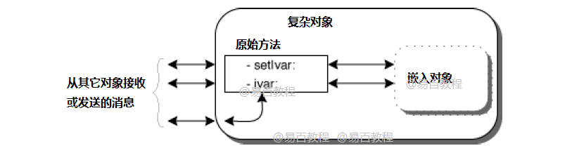
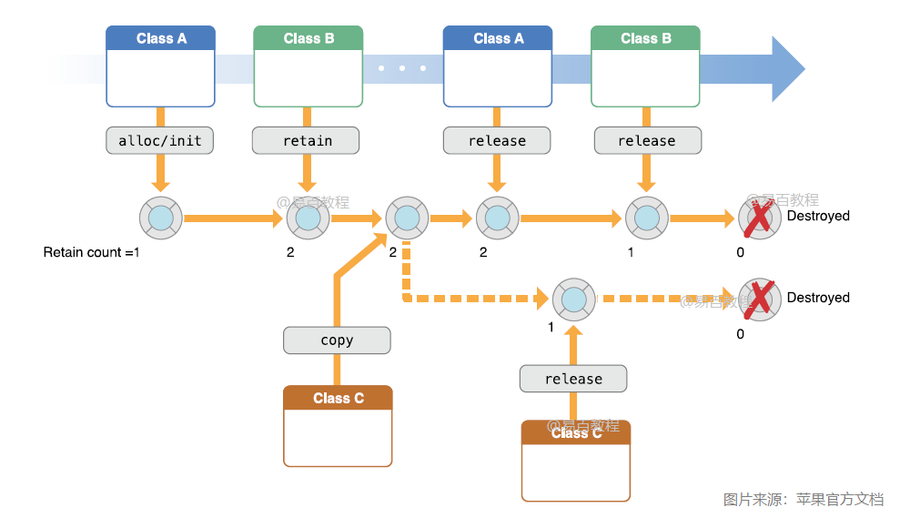

# Objective-C 高级部分

## Objective-C 类和对象

Objective-C 编程语言的主要目的是为 C 编程语言添加面向对象，类是 Objective-C 的核心特性，支持面向对象编程，通常称为用户定义类型。

类用于指定对象的形式，它将数据表示和方法组合在一起，以便将数据操作到一个整齐的包中。 类中的数据和方法称为类的成员。

### 1. Objective-C 特征

- 类定义在两个不同的部分，即`@interface`和`@implementation`。
- 几乎所有东西都是对象的形式。
- 对象接收消息，对象通常称为接收者。
- 对象包含实例变量。
- 对象和实例变量具有范围。
- 类隐藏对象的实现。
- 属性用于提供用于其他类对此类实例变量的访问。

### 2. Objective-C 类定义

定义类时，可以为数据类型定义蓝图(或模板)。 但实际上并没有定义任何数据，但它确实定义了类名的含义，即类的对象将包含什么以及可以对这样的对象执行什么操作。

类定义以关键字`@interface`开头，后跟接口(类)名称; 和一个由一对花括号括起来的类体。 在 Objective-C 中，所有类都派生自名为`NSObject`的基类。 它是所有 Objective-C 类的超类。 它提供了内存分配和初始化等基本方法。 例如，使用关键字`class`定义`Box`类，如下所示 -

```objc
@interface Box:NSObject {
   //实例变量
   double length;    // Length of a box
   double breadth;   // Breadth of a box
}
@property(nonatomic, readwrite) double height;  // Property

@end
Objective-C
```

实例变量是私有的，只能在类实现中访问。

### 3. 分配和初始化 Objective-C 对象

类提供对象的蓝图，因此基本上是从类创建对象。声明一个类的对象与声明基本类型变量的声明完全相同。以下语句声明了`Box`类的两个对象 -

```objc
Box box1 = [[Box alloc]init];     // Create box1 object of type Box
Box box2 = [[Box alloc]init];     // Create box2 object of type Box
Objective-C
```

`box1`和`box2`这两个对象都有自己的数据成员副本。

### 4. 访问数据成员

使用成员访问运算符(`.`)访问类对象的属性。尝试下面的例子来理解 -

```objc
#import <Foundation/Foundation.h>

@interface Box:NSObject {
   double length;    // Length of a box
   double breadth;   // Breadth of a box
   double height;    // Height of a box
}

@property(nonatomic, readwrite) double height;  // Property
-(double) volume;
@end

@implementation Box

@synthesize height;

-(id)init {
   self = [super init];
   length = 1.0;
   breadth = 1.0;
   return self;
}

-(double) volume {
   return length*breadth*height;
}

@end

int main() {
   NSAutoreleasePool * pool = [[NSAutoreleasePool alloc] init];
   Box *box1 = [[Box alloc]init];    // Create box1 object of type Box
   Box *box2 = [[Box alloc]init];    // Create box2 object of type Box

   double volume = 0.0;             // Store the volume of a box here

   // box 1 分配值
   box1.height = 15.0;

   // box 2 分配值
   box2.height = 20.0;

   // volume of box 1
   volume = [box1 volume];
   NSLog(@"Volume of Box1 : %f", volume);

   // volume of box 2
   volume = [box2 volume];
   NSLog(@"Volume of Box2 : %f", volume);

   [pool drain];
   return 0;
}
Objective-C
```

执行上面示例代码，得到以下结果：

```shell
$main
2018-11-16 01:29:42.781 main[106799] Volume of Box1 : 15.000000
2018-11-16 01:29:42.782 main[106799] Volume of Box2 : 20.000000
Shell
```

### 5. 属性

在 Objective-C 中引入了属性，以确保可以在类外部访问类的实例变量。

各部分属性声明如下 -

- 属性以`@property`开头，它是一个关键字
- 接下来是访问说明符，它们是非原子，读写或只读，强，不安全或不完整。 这取决于变量的类型。 对于任何指针类型，可以使用`strong`，`unsafe_unretained`或`weak`。 类似地，对于其他类型，可以使用`readwrite`或`readonly`。
- 接下来是变量的数据类型。
- 最后，将属性名称以分号结束。
- 在实现类中添加`synthesize`语句。 但是在最新的`XCode`中，合成部分由`XCode`处理，不需要包含`synthesize`语句。

只有属性才能访问类的实例变量。 实际上，为属性创建了内部`getter`和`setter`方法。例如，假设有一个属性`@property(nonatomic，readonly)BOOL isDone`。 创建了`setter`和`getter`，如下所示。

```shell
-(void)setIsDone(BOOL)isDone;
-(BOOL)isDone;
Shell
```

## Objective-C 继承

面向对象编程中最重要的概念之一是**继承**。继承允许根据一个类定义另一个类，这样可以更容易地创建和维护一个应用程序。 这也提供了重用代码功能和快速实现时间的机会。

在创建类时，程序员可以指定新类应该继承现有类的成员，而不是编写全新的数据成员和成员函数。 此现有类称为基类，新类称为派生类。

继承的想法实现了这种关系。 例如，哺乳动物是一个种类的动物，狗是一种哺乳动物，因此狗是一个动物等等。

### 1. 基础和派生类

Objective-C 只允许多级继承，即它只能有一个基类但允许多级继承。 Objective-C 中的所有类都派生自超类`NSObject`。

语法如下 -

```objc
@interface derived-class: base-class
Objective-C
```

考虑一个基类`Person`及其派生类`Employee`的继承关系实现如下 -

```objc
#import <Foundation/Foundation.h>

@interface Person : NSObject {
   NSString *personName;
   NSInteger personAge;
}

- (id)initWithName:(NSString *)name andAge:(NSInteger)age;
- (void)print;

@end

@implementation Person

- (id)initWithName:(NSString *)name andAge:(NSInteger)age {
   personName = name;
   personAge = age;
   return self;
}

- (void)print {
   NSLog(@"Name: %@", personName);
   NSLog(@"Age: %ld", personAge);
}

@end

@interface Employee : Person {
   NSString *employeeEducation;
}

- (id)initWithName:(NSString *)name andAge:(NSInteger)age
  andEducation:(NSString *)education;
- (void)print;
@end

@implementation Employee

- (id)initWithName:(NSString *)name andAge:(NSInteger)age
   andEducation: (NSString *)education {
      personName = name;
      personAge = age;
      employeeEducation = education;
      return self;
   }

- (void)print {
   NSLog(@"姓名: %@", personName);
   NSLog(@"年龄: %ld", personAge);
   NSLog(@"文化: %@", employeeEducation);
}

@end

int main(int argc, const char * argv[]) {
   NSAutoreleasePool * pool = [[NSAutoreleasePool alloc] init];
   NSLog(@"基类Person对象");
   Person *person = [[Person alloc]initWithName:@"Maxsu" andAge:25];
   [person print];
   NSLog(@"继承类Employee对象");
   Employee *employee = [[Employee alloc]initWithName:@"Yii bai"
   andAge:26 andEducation:@"MBA"];
   [employee print];
   [pool drain];
   return 0;
}
Objective-C
```

执行上面示例代码，得到以下结果：

```shell
2018-11-16 01:51:21.279 main[138079] 基类Person对象
2018-11-16 01:51:21.280 main[138079] Name: Maxsu
2018-11-16 01:51:21.281 main[138079] Age: 25
2018-11-16 01:51:21.281 main[138079] 继承类Employee对象
2018-11-16 01:51:21.281 main[138079] 姓名: Yii bai
2018-11-16 01:51:21.281 main[138079] 年龄: 26
2018-11-16 01:51:21.281 main[138079] 文化: MBA
Shell
```

### 2. 访问控制和继承

如果派生类在接口类中定义，则它可以访问其基类的所有私有成员，但它不能访问在实现文件中定义的私有成员。

可以通过以下方式访问它们来执行不同的访问类型。派生类继承所有基类方法和变量，但以下情况除外 -

- 无法访问在扩展帮助下在实现文件中声明的变量。
- 无法访问在扩展帮助下在实现文件中声明的方法。
- 如果继承的类在基类中实现该方法，则执行继承类中的方法。

## Objective-C 多态性

多态性这个词表示有许多形式。 通常，当存在类的层次结构并且通过继承相关时，会发生多态性。

Objective-C 多态表示对成员函数的调用将导致执行不同的函数，具体取决于调用该函数的对象的类型。

考虑下面一个例子，有一个基类`Shape`类，它为所有形状提供基本接口。 `Square`和`Rectangle`类派生自基`Shape`类。

下面使用`printArea`方法来展示 OOP 特征多态性。

```objc
#import <Foundation/Foundation.h>

@interface Shape : NSObject {
   CGFloat area;
}

- (void)printArea;
- (void)calculateArea;
@end

@implementation Shape
- (void)printArea {
   NSLog(@"The area is %f", area);
}

- (void)calculateArea {

}

@end

@interface Square : Shape {
   CGFloat length;
}

- (id)initWithSide:(CGFloat)side;
- (void)calculateArea;

@end

@implementation Square
- (id)initWithSide:(CGFloat)side {
   length = side;
   return self;
}

- (void)calculateArea {
   area = length * length;
}

- (void)printArea {
   NSLog(@"The area of square is %f", area);
}

@end

@interface Rectangle : Shape {
   CGFloat length;
   CGFloat breadth;
}

- (id)initWithLength:(CGFloat)rLength andBreadth:(CGFloat)rBreadth;
@end

@implementation Rectangle
- (id)initWithLength:(CGFloat)rLength andBreadth:(CGFloat)rBreadth {
   length = rLength;
   breadth = rBreadth;
   return self;
}

- (void)calculateArea {
   area = length * breadth;
}

@end

int main(int argc, const char * argv[]) {
   NSAutoreleasePool * pool = [[NSAutoreleasePool alloc] init];
   Shape *square = [[Square alloc]initWithSide:10.0];
   [square calculateArea];
   [square printArea];
   Shape *rect = [[Rectangle alloc]
   initWithLength:10.0 andBreadth:5.0];
   [rect calculateArea];
   [rect printArea];
   [pool drain];
   return 0;
}
Objective-C
```

执行上面示例代码，得到以下结果 -

```shell
2018-11-16 02:02:22.096 main[159689] The area of square is 100.000000
2018-11-16 02:02:22.098 main[159689] The area is 50.000000
Shell
```

在上面的示例中，`calculateArea`和`printArea`方法的可用性，无论是基类中的方法还是执行派生类。

多态性基于两个类的方法实现来处理基类和派生类之间的方法切换。

## Objective-C 数据封装

所有 Objective-C 程序都由以下两个基本要素组成 -

- **程序语句(代码)** - 这是执行操作的程序的一部分，它们被称为方法(函数)。
- **程序数据** - 数据是受程序功能影响的程序信息。

封装是一种面向对象的编程概念，它将操作数据的数据和功能绑定在一起，并保护其免受外部干扰和误用。 数据封装导致了重要的 OOP 数据隐藏概念。

数据封装是捆绑数据和使用函数的机制，数据抽象是一种仅暴露接口并从用户隐藏实现细节的机制。

Objective-C 通过创建用户定义类型(称为类)来支持封装和数据隐藏的属性。 例如 -

```objc
@interface Adder : NSObject {
   NSInteger total;
}

- (id)initWithInitialNumber:(NSInteger)initialNumber;
- (void)addNumber:(NSInteger)newNumber;
- (NSInteger)getTotal;

@end
Objective-C
```

变量`total`是私有的，因此无法从类外部访问。只能由`Adder`类的其他成员访问它们，而不能由程序的任何其他部分访问。这是实现封装的一种方式。

接口文件中的方法是可访问的，并且在范围内是公共的。

有一些私有方法，这些方法是在扩展的帮助下编写的，我们将在后面的章节中学习。

### 1. 数据封装示例

任何使用公共和私有成员变量实现类的 Objective-C 程序都是数据封装和数据抽象的一个例子。 考虑以下示例 -

```objc
#import <Foundation/Foundation.h>

@interface Adder : NSObject {
   NSInteger total;
}

- (id)initWithInitialNumber:(NSInteger)initialNumber;
- (void)addNumber:(NSInteger)newNumber;
- (NSInteger)getTotal;

@end

@implementation Adder
-(id)initWithInitialNumber:(NSInteger)initialNumber {
   total = initialNumber;
   return self;
}

- (void)addNumber:(NSInteger)newNumber {
   total = total + newNumber;
}

- (NSInteger)getTotal {
   return total;
}

@end

int main(int argc, const char * argv[]) {
   NSAutoreleasePool * pool = [[NSAutoreleasePool alloc] init];
   Adder *adder = [[Adder alloc]initWithInitialNumber:10];
   [adder addNumber:15];
   [adder addNumber:14];

   NSLog(@"The total is %ld",[adder getTotal]);
   [pool drain];
   return 0;
}
Objective-C
```

执行上面示例代码，得到以下结果：

```shell
2018-11-16 02:19:46.326 main[52227] The total is 39
Shell
```

上面的类将数字值相加并返回总和。 公共成员`addNum`和`getTotal`是外部接口，用户需要知道它们才能使用该类。 私有成员`total`是对外界隐藏的东西，但是此类需要正常运作。

### 2. 设计策略

除非真的需要公开它们，否则大多数人都会通过经验来学习默认情况下将类成员设为私有。 这只是很好的封装。

了解数据封装非常重要，因为它是所有面向对象编程(OOP)语言(包括 Objective-C)的核心功能之一。

## Objective-C 类别

有时，可能会发现希望通过添加仅在某些情况下有用的行为来扩展现有类。 要向现有类添加此类扩展，Objective-C 提供了类别和扩展。

如果需要向现有类添加方法，或许为了添加功能以便在应用程序中更容易地执行某些操作，最简单的方法是使用类别。

声明类别的语法使用`@interface`关键字，就像标准的 Objective-C 类描述一样，但不表示子类的任何继承。在括号中指定类别的名称，如下所示 -

```objc
@interface ClassName (CategoryName)

@end
Objective-C
```

### 1. 类别的特征

即使没有原始实现源代码，也可以为任何类声明类别。在类别中声明的任何方法都可用于原始类的所有实例，以及原始类的任何子类。在运行时，类别添加的方法与原始类实现的方法之间没有区别。

现在，来看一个类别实现的示例。在 Cocoa 类`NSString`中添加一个类别。此类别将使可以添加一个新方法`getCopyRightString`，它返回版权字符串。 如下所示 -

```objc
#import <Foundation/Foundation.h>

@interface NSString(MyAdditions)
+(NSString *)getCopyRightString;
@end

@implementation NSString(MyAdditions)

+(NSString *)getCopyRightString {
   return @"Copyright y ii bai.com 2019";
}

@end

int main(int argc, const char * argv[]) {
   NSAutoreleasePool * pool = [[NSAutoreleasePool alloc] init];
   NSString *copyrightString = [NSString getCopyRightString];
   NSLog(@"Accessing Category: %@",copyrightString);

   [pool drain];
   return 0;
}
Objective-C
```

执行上面示例代码，得到以下结果：

```shell
2018-11-16 02:45:34.949 main[131207] Accessing Category: Copyright y ii bai.com 2019
Shell
```

即使类别添加的任何方法都可用于类及其子类的所有实例，仍需要在任何源代码文件中导入类别头文件，否则将遇到编译器警告和错误。

在上面示例中，由于只有一个类，因此没有包含任何头文件，在这种情况下应该包含如上所述的头文件。

## Objective-C Posing

Posing，顾名思义，意思是“冒充”，它跟`categories`类似，但本质上不一样，Posing 存在的目的在于子类可以冒充父类，使得后续的代码无需把父类修改为子类，就可以很方便的让父类表现成子类的行为，从而实现非常方便的冒充，这在一般的语言中是难以想象的。

在开始在 Objective-C 中进行构建之前，提醒读者注意，在 Mac OS X 10.5 中声明已经弃用了冒充(_Posing_)，并且之后无法使用它。 因此对于那些不关心这些弃用方法的人可以跳过本章。

Objective-C 允许类完全替换程序中的另一个类。替换类被称为“冒充”目标类。 对于支持冒充的版本，发送到目标类的所有消息都由冒充类接收。

`NSObject`包含`poseAsClass` - 使我们能够替换现有类的方法，如上所述。

它允许扩展一个类，并且全面的冒充这个超类，比如：有一个扩展`NSArray`的`NSArrayChild`对象，如果让`NSArrayChild`冒充`NSArray`，则程序代码所在的`NSArray`都会自动替换为`NSArrayChild`。注意，这里不是指代码替换，而是`NSArray`所在地方的行为都跟`NSArrayChild`一样了。

#### 冒充限制

- 一个类只能构成其直接或间接超类之一。
- 冒充类不得定义目标类中不存在的任何新实例变量(尽管它可以定义或覆盖方法)。
- 目标类在冒充之前可能没有收到任何消息。
- 冒充类可以通过`super`调用重写的方法，从而结合目标类的实现。
- 冒充类可以覆盖类别中定义的方法。

示例代码：

```objc
#import <Foundation/Foundation.h>

@interface MyString : NSString

@end

@implementation MyString

- (NSString *)stringByReplacingOccurrencesOfString:(NSString *)target
withString:(NSString *)replacement {
   NSLog(@"The Target string is %@",target);
   NSLog(@"The Replacement string is %@",replacement);
}

@end

int main() {
   NSAutoreleasePool * pool = [[NSAutoreleasePool alloc] init];
   [MyString poseAsClass:[NSString class]];
   NSString *string = @"Test";
   [string stringByReplacingOccurrencesOfString:@"a" withString:@"c"];

   [pool drain];
   return 0;
}
Objective-C
```

执行上面示例代码，得到以下结果：

```shell
2018-11-22 21:23:44.729 Posing[372:306] The Target string is a
2018-11-22 21:23:44.730 Posing[372:306] The Replacement string is c
Shell
```

在上面的例子中，只是用实现污染了原始方法，并且这将通过上述方法在所有`NSString`操作中受到影响。

## Objective-C 扩展

类扩展与类别有一些相似之处，但它只能添加到编译时具有源代码的类中(类与类扩展同时编译)。

类扩展声明的方法是在原始类的实现块中实现的，因此不能在框架类上声明类扩展，例如`Cocoa`或`Cocoa Touch`类，如`NSString`。

扩展名实际上是没有类别名称的类别，它通常被称为匿名类别。

声明扩展的语法使用`@interface`关键字，就像标准的 Objective-C 类描述一样，但不表示子类的任何继承。 它只是添加括号，如下所示 -

```objc
@interface ClassName ()

@end
Objective-C
```

#### 扩展的特征

- 不能为任何类声明扩展，仅适用于原始实现源代码的类。
- 扩展是添加仅特定于类的私有方法和私有变量。
- 扩展内部声明的任何方法或变量即使对于继承的类也是不可访问的。

#### 扩展示例

创建一个具有扩展名的`SampleClass`类。 在扩展中，有一个私有变量`internalID`。然后，有一个方法`getExternalID`，它在处理`internalID`后返回`externalID`。

示例代码如下所示 -

```objc
#import <Foundation/Foundation.h>

@interface SampleClass : NSObject {
   NSString *name;
}

- (void)setInternalID;
- (NSString *)getExternalID;

@end

@interface SampleClass() {
   NSString *internalID;
}

@end

@implementation SampleClass

- (void)setInternalID {
   internalID = [NSString stringWithFormat:
   @"UNIQUEINTERNALKEY%dUNIQUEINTERNALKEY",arc4random()%100];
}

- (NSString *)getExternalID {
   return [internalID stringByReplacingOccurrencesOfString:
   @"UNIQUEINTERNALKEY" withString:@""];
}

@end

int main(int argc, const char * argv[]) {
   NSAutoreleasePool * pool = [[NSAutoreleasePool alloc] init];
   SampleClass *sampleClass = [[SampleClass alloc]init];
   [sampleClass setInternalID];
   NSLog(@"ExternalID: %@",[sampleClass getExternalID]);
   [pool drain];
   return 0;
}
Objective-C
```

执行上面示例代码，得到以下结果：

```shell
2019-11-22 12:18:32.124 Extensions[121:313] ExternalID: 51
Shell
```

在上面的示例中，可以看到不直接返回`internalID`。在这里删除了`UNIQUEINTERNALKEY`，并且只为方法`getExternalID`提供了剩余的值。上面的示例只使用字符串操作，但它可以具有许多功能，如加密/解密等。

## Objective-C 协议

Objective-C 允许定义协议，声明预期用于特定情况的方法。 协议在符合协议的类中实现。

一个简单的例子是网络`URL`处理类，它将具有一个协议，其中包含`processCompleted`委托方法等方法，当网络 URL 提取操作结束，就会调用类。

协议的语法如下所示 -

```objc
@protocol ProtocolName
@required
// list of required methods
@optional
// list of optional methods
@end
Objective-C
```

关键字`@required`下的方法必须在符合协议的类中实现，并且`@optional`关键字下的方法是可选的。

以下是符合协议的类的语法 -

```objc
@interface MyClass : NSObject <MyProtocol>
...
@end
Objective-C
```

`MyClass`的任何实例不仅会响应接口中特定声明的方法，而且`MyClass`还会为`MyProtocol`中的所需方法提供实现。 没有必要在类接口中重新声明协议方法 - 采用协议就足够了。

如果需要一个类来采用多个协议，则可以将它们指定为以逗号分隔的列表。下面有一个委托对象，它包含实现协议的调用对象的引用。

一个例子如下所示 -

```objc
#import <Foundation/Foundation.h>

@protocol PrintProtocolDelegate
- (void)processCompleted;

@end

@interface PrintClass :NSObject {
   id delegate;
}

- (void) printDetails;
- (void) setDelegate:(id)newDelegate;
@end

@implementation PrintClass
- (void)printDetails {
   NSLog(@"Printing Details");
   [delegate processCompleted];
}

- (void) setDelegate:(id)newDelegate {
   delegate = newDelegate;
}

@end

@interface SampleClass:NSObject<PrintProtocolDelegate>
- (void)startAction;

@end

@implementation SampleClass
- (void)startAction {
   PrintClass *printClass = [[PrintClass alloc]init];
   [printClass setDelegate:self];
   [printClass printDetails];
}

-(void)processCompleted {
   NSLog(@"Printing Process Completed");
}

@end

int main(int argc, const char * argv[]) {
   NSAutoreleasePool * pool = [[NSAutoreleasePool alloc] init];
   SampleClass *sampleClass = [[SampleClass alloc]init];
   [sampleClass startAction];
   [pool drain];
   return 0;
}
Objective-C
```

执行上面示例代码，得到以下结果 -

```shell
2018-11-16 03:10:19.639 main[18897] Printing Details
2018-11-16 03:10:19.641 main[18897] Printing Process Completed
Shell
```

在上面的例子中，已经看到了如何调用和执行委托方法。 它以`startAction`开始，当进程完成，就会调用委托方法`processCompleted`以使操作完成。

在任何 iOS 或 Mac 应用程序中，如果没有代理，将永远不会实现程序。 因此，要是了解委托的用法。 委托对象应使用`unsafe_unretained`属性类型以避免内存泄漏。

## Objective-C 动态绑定

动态绑定确定在运行时而不是在编译时调用的方法。 动态绑定也称为后期绑定。 在 Objective-C 中，所有方法都在运行时动态解析。执行的确切代码由方法名称(选择器)和接收对象确定。

动态绑定可实现多态性。例如，考虑一组对象，包括`Rectangle`和`Square`。 每个对象都有自己的`printArea`方法实现。

在下面的代码片段中，表达式`[anObject printArea]`执行的实际代码是在运行时确定的。 运行时系统使用方法运行的选择器来识别`anObject`的任何类中的适当方法。

下面来看一下解释动态绑定的简单代码 -

```objc
#import <Foundation/Foundation.h>

@interface Square:NSObject {
   float area;
}

- (void)calculateAreaOfSide:(CGFloat)side;
- (void)printArea;
@end

@implementation Square
- (void)calculateAreaOfSide:(CGFloat)side {
   area = side * side;
}

- (void)printArea {
   NSLog(@"The area of square is %f",area);
}

@end

@interface Rectangle:NSObject {
   float area;
}

- (void)calculateAreaOfLength:(CGFloat)length andBreadth:(CGFloat)breadth;
- (void)printArea;
@end

@implementation  Rectangle

- (void)calculateAreaOfLength:(CGFloat)length andBreadth:(CGFloat)breadth {
   area = length * breadth;
}

- (void)printArea {
   NSLog(@"The area of Rectangle is %f",area);
}

@end

int main() {
   Square *square = [[Square alloc]init];
   [square calculateAreaOfSide:8.0];

   Rectangle *rectangle = [[Rectangle alloc]init];
   [rectangle calculateAreaOfLength:10.0 andBreadth:20.0];

   NSArray *shapes = [[NSArray alloc]initWithObjects: square, rectangle,nil];
   id object1 = [shapes objectAtIndex:0];
   [object1 printArea];

   id object2 = [shapes objectAtIndex:1];
   [object2 printArea];

   return 0;
}
Objective-C
```

执行上面示例代码，得到以下结果 -

```shell
2018-11-16 03:16:53.399 main[53860] The area of square is 64.000000
2018-11-16 03:16:53.401 main[53860] The area of Rectangle is 200.000000
Shell
```

正如在上面的示例中所看到的，`printArea`方法是在运行时动态选择调用的。 它是动态绑定的一个示例，在处理类似对象时在很多情况下非常有用。

## Objective-C 复合对象

在 Objective-C 中，可以在类集群中创建子类，该类集合定义了一个嵌入在其中的类。 这些类对象是复合对象。你可能想知道什么是类集群，下面首先了解什么是类集群。

### 1. 类集群

类集群是基础框架广泛使用的设计模式。 类集群在公共抽象超类下组合了许多私有具体子类。 以这种方式对类进行分组简化了面向对象框架的公开可见体系结构，而不会降低其功能丰富性。 类集群基于抽象工厂设计模式。

为了简单起见，创建了一个基于输入值处理它的单个类，而不是为类似的函数创建多个类。

例如，在`NSNumber`中有许多类的集群，如`char`，`int`，`bool`等。将它们全部组合到一个类中，该类负责处理单个类中的类似操作。 `NSNumber`实际上将这些原始类型的值包装到对象中。

### 2. 什么是复合对象？

通过在设计的对象中嵌入私有集群对象，创建一个复合对象。 此复合对象可以依赖于集群对象的基本功能，仅拦截复合对象希望以某种特定方式处理的消息。 此体系结构减少了必须编写的代码量，并允许利用 Foundation Framework 提供的测试代码。

如下图中解释 - 

复合对象必须声明自己是集群的抽象超类的子类。 作为子类，它必须覆盖超类的原始方法。 它也可以覆盖派生方法，但这不是必需的，因为派生方法通过原始方法工作。

`NSArray`类的`count`方法就是一个例子; 介入对象的覆盖方法的实现可以实现简单如下 -

```objc
- (unsigned)count  {
   return [embeddedObject count];
}
Objective-C
```

在上面的例子中，嵌入对象实际上是`NSArray`类型。

### 复合对象示例

现在，为了看到一个完整的示例，请看下面给出的 Apple 文档中的示例。

```objc
#import <Foundation/Foundation.h>

@interface ValidatingArray : NSMutableArray {
   NSMutableArray *embeddedArray;
}

+ validatingArray;
- init;
- (unsigned)count;
- objectAtIndex:(unsigned)index;
- (void)addObject:object;
- (void)replaceObjectAtIndex:(unsigned)index withObject:object;
- (void)removeLastObject;
- (void)insertObject:object atIndex:(unsigned)index;
- (void)removeObjectAtIndex:(unsigned)index;

@end

@implementation ValidatingArray
- init {
   self = [super init];
   if (self) {
      embeddedArray = [[NSMutableArray allocWithZone:[self zone]] init];
   }
   return self;
}

+ validatingArray {
   return [[self alloc] init] ;
}

- (unsigned)count {
   return [embeddedArray count];
}

- objectAtIndex:(unsigned)index {
   return [embeddedArray objectAtIndex:index];
}

- (void)addObject:(id)object {
   if (object != nil) {
      [embeddedArray addObject:object];
   }
}

- (void)replaceObjectAtIndex:(unsigned)index withObject:(id)object; {
   if (index <[embeddedArray count] && object != nil) {
      [embeddedArray replaceObjectAtIndex:index withObject:object];
   }
}

- (void)removeLastObject; {
   if ([embeddedArray count] > 0) {
      [embeddedArray removeLastObject];
   }
}

- (void)insertObject:(id)object atIndex:(unsigned)index; {
   if (object != nil) {
      [embeddedArray insertObject:object atIndex:index];
   }
}

- (void)removeObjectAtIndex:(unsigned)index; {
   if (index <[embeddedArray count]) {
      [embeddedArray removeObjectAtIndex:index];
   }
}

@end

int main() {
   NSAutoreleasePool * pool = [[NSAutoreleasePool alloc] init];
   ValidatingArray *validatingArray = [ValidatingArray validatingArray];

   [validatingArray addObject:@"Object1"];
   [validatingArray addObject:@"Object2"];
   [validatingArray addObject:[NSNull null]];
   [validatingArray removeObjectAtIndex:2];
   NSString *aString = [validatingArray objectAtIndex:1];
   NSLog(@"The value at Index 1 is %@",aString);
   [pool drain];

   return 0;
}
Objective-C
```

执行上面示例代码，得到以下结果：

```shell
2018-11-28 22:03:54.124 main[3247] The value at Index 1 is Object2
Shell
```

在上面的例子中，可以看到验证数组的一个函数不允许添加会导致正常情况下崩溃的空对象。 但验证数组负责处理它。 类似地，验证数组中的每个方法都添加了除正常操作序列之外的验证过程。

## Objective_C 基础框架

如果您参考 Apple 文档，应该会看到`Foundation`框架的详细信息，如下所示。

`Foundation`框架定义了 Objective-C 类的基础层。 除了提供一组有用的原始对象类之外，它还引入了几个定义 Objective-C 语言未涵盖的功能的范例。 `Foundation`框架的设计考虑了这些目标 -

- 提供一小组基本实用程序类。
- 通过为解除分配等事项引入一致的约定，使软件开发更容易。
- 支持 Unicode 字符串，对象持久性和对象分发。
- 提供一定程度的操作系统独立性以增强可移植性。

该框架由*NeXTStep* 开发，后者被 Apple 收购，这些基础类成为 Mac OS X 和 iOS 的一部分。 由 NeXTStep 开发，它的类前缀为“NS”。

在所有示例程序中都使用了`Foundation`框架，在使用 Objective-C 语言开发应用程序时，使用`Foundation`框架几乎是必须的。

通常，我们使用`#import <Foundation/NSString.h>`之类的东西来导入 Objective-C 类，但是为了避免手写导入的类太多，使用`#import <Foundation/Foundation.h>`导入即可。

`NSObject`是所有对象的基类，包括基础工具包类。 它提供了内存管理的方法。 它还提供了运行时系统的基本接口以及表现为 Objective-C 对象的能力。它没有任何基类，是所有类的根。

### 基础类的功能

| 编号 | 功能 | 描述 |
| --- | --- | --- |
| 1 | [数据存储](https://www.yiibai.com/objective_c/objective_c_data_storage.html) | `NSArray`，`NSDictionary`和`NSSet`为 Objective-C 任何类的对象提供存储。 |
| 2 | [文本和字符串](https://www.yiibai.com/objective_c/objective_c_texts_and_strings.html) | `NSCharacterSet`表示`NSString`和`NSScanner`类使用的各种字符分组。`NSString`类表示文本字符串，并提供搜索，组合和比较字符串的方法。 `NSScanner`对象用于扫描`NSString`对象中的数字和单词。 |
| 3 | [日期和时间](https://www.yiibai.com/objective_c/objective_c_dates_and_times.html) | `NSDate`，`NSTimeZone`和`NSCalendar`类存储时间和日期并表示日历信息。它们提供了计算日期和时间差异的方法。它们与`NSLocale`一起提供了以多种格式显示日期和时间以及根据世界中的位置调整时间和日期的方法。 |
| 4 | [异常处理](https://www.yiibai.com/objective_c/objective_c_exception_handling.html) | 异常处理用于处理意外情况，它在 Objective-C 中提供`NSException`类对象。 |
| 5 | [文件处理](https://www.yiibai.com/objective_c/objective_c_file_handling.html) | 文件处理是在`NSFileManager`类的帮助下完成的。 |
| 6 | [URL 加载系统](https://www.yiibai.com/objective_c/objective_c_url_loading_system.html) | 一组提供对常见 Internet 协议访问的类和协议。 |

## Objective-C 快速枚举

快速枚举是 Objective-C 的功能，用于枚举集合。 因此，要了解快速枚举，首先需要了解集合，这将在下一节中进行说明。

### 1. Objective-C 集合

集合是基本结构。它用于保存和管理其他对象。 集合的主要目的是提供一种有效存储和检索对象的通用方法。

有几种不同类型的集合。 虽然它们都能实现能够容纳其他对象的相同目的，但它们的主要区别在于检索对象的方式。 Objective-C 中使用的最常见的集合是 -

- `NSSet`
- `NSArray`
- `NSDictionary`
- `NSMutableSet`
- `NSMutableArray`
- `NSMutableDictionary`

如果想了解有关这些结构的更多信息，请参阅[Foundation 框架](https://www.yiibai.com/objective_c/objective_c_foundation_framework.html)中的数据存储。

**快速枚举语法**

```objc
for (classType variable in collectionObject ) {
  statements
}
Objective-C
```

以下是快速枚举的示例 -

```objc
#import <Foundation/Foundation.h>

int main() {
   NSAutoreleasePool * pool = [[NSAutoreleasePool alloc] init];
   NSArray *array = [[NSArray alloc]
   initWithObjects:@"string1", @"string2",@"string3",@"yii",@"bai",nil];

   for(NSString *aString in array) {
      NSLog(@"Value: %@",aString);
   }

   [pool drain];
   return 0;
}
Objective-C
```

执行上面示例代码，得到以下结果 -

```shell
2018-11-16 06:09:09.615 main[180842] Value: string1
2018-11-16 06:09:09.618 main[180842] Value: string2
2018-11-16 06:09:09.618 main[180842] Value: string3
2018-11-16 06:09:09.618 main[180842] Value: yii
2018-11-16 06:09:09.618 main[180842] Value: bai
Shell
```

如在输出中看到的那样，数组中的每个对象都按顺序打印。

**快速枚举向后**

```objc
for (classType variable in [collectionObject reverseObjectEnumerator] ) {
  statements
}
Objective-C
```

以下是快速枚举中`reverseObjectEnumerator`的示例 -

```objc
#import <Foundation/Foundation.h>

int main() {
   NSAutoreleasePool * pool = [[NSAutoreleasePool alloc] init];
   NSArray *array = [[NSArray alloc]
   initWithObjects:@"string1", @"string2",@"string3",@"Yii",@"Bai",nil];

   for(NSString *aString in [array reverseObjectEnumerator]) {
      NSLog(@"Value: %@",aString);
   }

   [pool drain];
   return 0;
}
Objective-C
```

执行上面示例代码，得到以下结果 -

```shell
2018-11-16 06:11:46.903 main[43643] Value: Bai
2018-11-16 06:11:46.904 main[43643] Value: Yii
2018-11-16 06:11:46.905 main[43643] Value: string3
2018-11-16 06:11:46.905 main[43643] Value: string2
2018-11-16 06:11:46.905 main[43643] Value: string1
Shell
```

正如您在输出中看到的那样，与正常快速枚举相比，数组中的每个对象都以相反的顺序打印。

## Objective-C 内存管理

内存管理是任何编程语言中最重要的过程之一。它是在需要时分配对象的内存并在不再需要时取消分配的过程。

管理对象内存是一个性能问题; 如果应用程序不释放不需要的对象，则应用程序会因内存占用增加并且性能受损。

Objective-C 内存管理技术大致可分为两类 -

- “手动保留或释放”或 MRR
- “自动参考计数”或 ARC

### 1. “手动保留释放”或 MRR

在 MRR 中，通过跟踪自己的对象来明确管理内存。这是使用一个称为引用计数的模型实现的，`Foundation`类`NSObject`与运行时环境一起提供。

MRR 和 ARC 之间的唯一区别是保留和释放，前者是手动处理，而后者则自动处理。

下图表示内存管理在 Objective-C 中的工作方式示例。



`A`类对象的内存生命周期如上图所示。 如您所见，保留计数显示在对象下方，当对象的保留计数变为`0`时，对象将被完全释放，并且其内存将被释放以供其他对象使用。

首先使用`NSObject`中提供的`alloc/init`方法创建`A`类对象。 现在，保留计数变为`1`。现在，`B`类保留了`A`类的对象，`A`类对象的保留计数变为`2`。

然后，`C`类拷贝该对象的副本。它被创建为`A`类的另一个实例，具有相同的实例变量值。 这里，保留计数是`1`而不是原始对象的保留计数。如图中的虚线表示。

使用`release`方法由`C`类释放复制的对象，并且保留计数变为`0`，因此对象被销毁。

对于初始的`A`类对象，保留计数为`2`，所以必须释放两次才能销毁它。 这是通过`A`类和`B`类的释放语句完成的，它们将保留计数分别减少到`1`和`0`。 最后，对象就被销毁了。

### 2. MRR 基本规则

- 拥有创建的任何对象：使用名称以“alloc”，“new”，“copy”或“mutableCopy”开头的方法创建对象
- 使用`retain`获取对象的所有权：通常保证接收到的对象在接收到的方法中保持有效，并且该方法也可以安全地将对象返回给它的调用者。在两种情况下使用`retain` -
  - 在访问器方法或`init`方法的实现中，获取想要存储为对象属性值的对象的所有权。
  - 防止对象因某些其他操作的副作用而失效。
- 当不再需要它时，必须放弃对拥有的对象的所有权：通过向对象发送释放消息或自动释放消息来放弃对象的所有权。 因此，在 Cocoa 术语中，放弃对象的所有权通常被称为“释放”对象。
- 不得放弃不拥有的对象的所有权。

**示例代码**

```objc
#import <Foundation/Foundation.h>

@interface SampleClass:NSObject
- (void)sampleMethod;
@end

@implementation SampleClass
- (void)sampleMethod {
   NSLog(@"Hello, World! \n");
}

- (void)dealloc  {
  NSLog(@"Object deallocated");
  [super dealloc];
}

@end

int main() {

   /* 第一个Objective-C程序 */
   SampleClass *sampleClass = [[SampleClass alloc]init];
   [sampleClass sampleMethod];

   NSLog(@"Retain Count after initial allocation: %d",
   [sampleClass retainCount]);
   [sampleClass retain];

   NSLog(@"Retain Count after retain: %d", [sampleClass retainCount]);
   [sampleClass release];
   NSLog(@"Retain Count after release: %d", [sampleClass retainCount]);
   [sampleClass release];
   NSLog(@"SampleClass dealloc will be called before this");

   // 应该将对象设置为nil
   sampleClass = nil;
   return 0;
}
Objective-C
```

执行上面示例代码，得到以下结果 -

```shell
2018-11-16 07:02:42.556 main[152785] Hello, World!
2018-11-16 07:02:42.558 main[152785] Retain Count after initial allocation: 1
2018-11-16 07:02:42.558 main[152785] Retain Count after retain: 2
2018-11-16 07:02:42.558 main[152785] Retain Count after release: 1
2018-11-16 07:02:42.558 main[152785] Object deallocated
2018-11-16 07:02:42.558 main[152785] SampleClass dealloc will be called before this
Shell
```

### 3. “自动参考计数”或 ARC

在自动引用计数或 ARC 中，系统使用与 MRR 相同的引用计数系统，但它在编译时为我们插入适当的内存管理方法调用。 强烈建议将 ARC 用于新项目。 如果使用 ARC，通常不需要理解本文档中描述的底层实现，尽管在某些情况下它可能会有所帮助。 有关 ARC 的更多信息，请[参阅 ARC 发行说明](https://developer.apple.com/library/ios/releasenotes/ObjectiveC/RN-TransitioningToARC/Introduction/Introduction.html)。

如上所述，在 ARC 中，不需要添加`release`和`retain`方法，因为编译器会对此进行处理。 实际上，Objective-C 的基本过程仍然是相同的。 它在内部使用保留和释放操作，使开发人员更容易编码而无需担心这些操作，这将减少写入的代码量和内存泄漏的可能性。

还有另一个原则叫做垃圾收集，它在 Mac OS-X 中与 MRR 一起使用，但由于它在 OS-X Mountain Lion 中的弃用，它还没有与 MRR 一起讨论过。 此外，iOS 对象从未拥有垃圾收集功能。 使用 ARC，OS-X 中也没有使用垃圾收集。

这是一个简单的 ARC 示例。 请注意，这不适用于在线编译器，因为它不支持 ARC。

```objc
#import <Foundation/Foundation.h>

@interface SampleClass:NSObject
- (void)sampleMethod;
@end

@implementation SampleClass
- (void)sampleMethod {
   NSLog(@"Hello, World! \n");
}

- (void)dealloc  {
  NSLog(@"Object deallocated");
}

@end

int main() {
   /* my first program in Objective-C */
   @autoreleasepool {
      SampleClass *sampleClass = [[SampleClass alloc]init];
      [sampleClass sampleMethod];
      sampleClass = nil;
   }
   return 0;
}
```

执行上面示例代码，得到以下结果 -

```shell
2018-10-28 08:45:17.210 demo[8385] Hello, World!
2018-10-28 08:45:17.211 demo[8385] Object deallocated
Shell
```

## 来源

[https://www.yiibai.com/objective_c/objective_c_overview.html](https://www.yiibai.com/objective_c/objective_c_overview.html)
