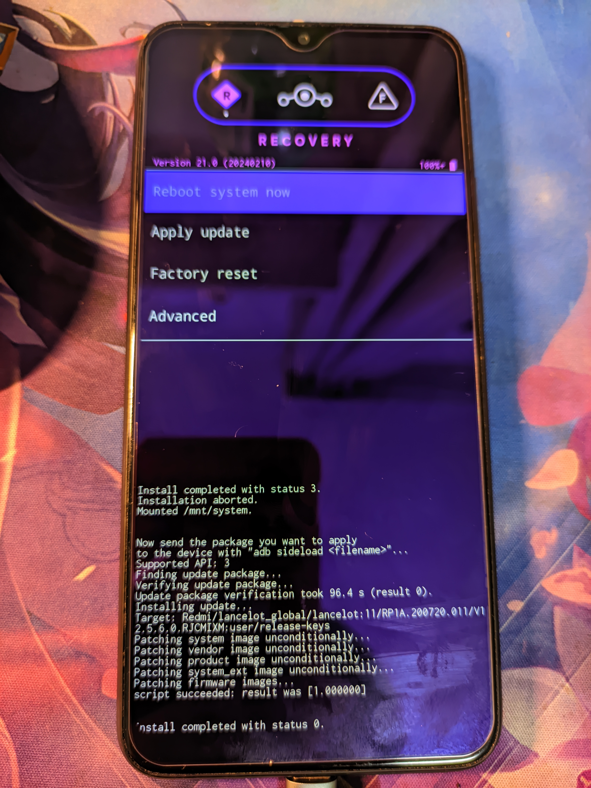
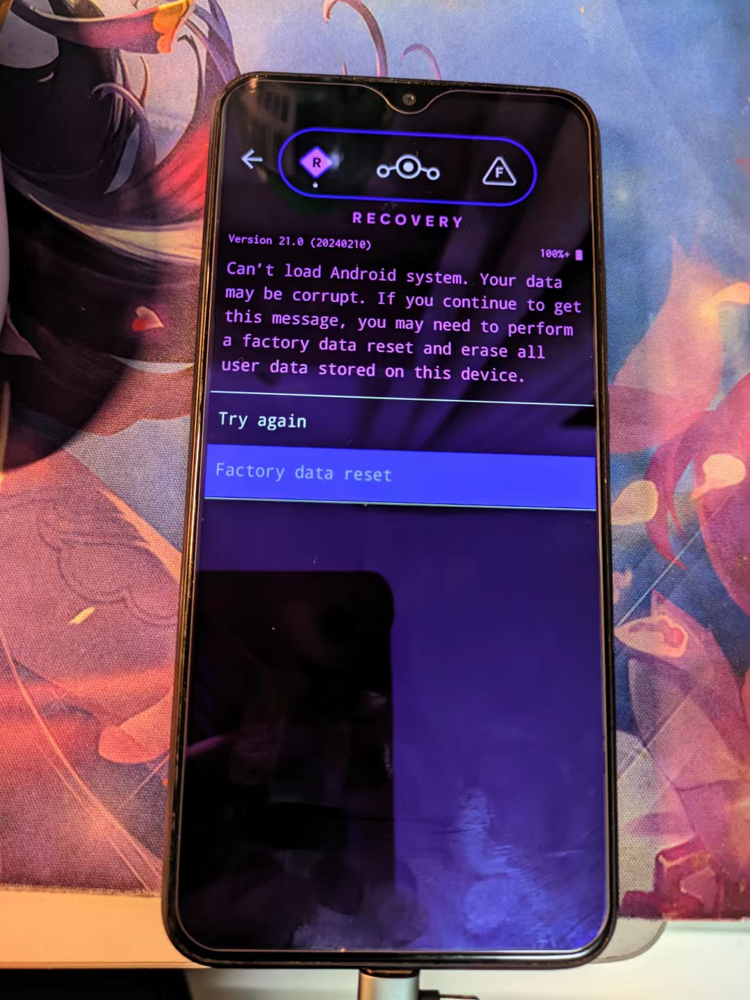
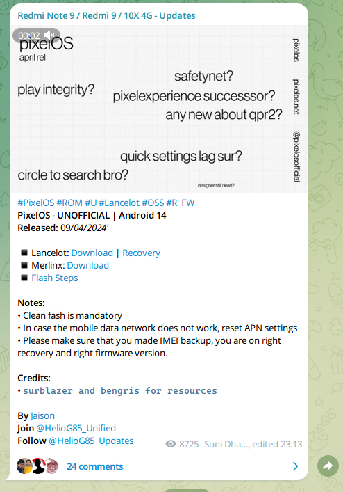

# Redmi9 lancelot

来源于家人换下的手机，最新 miui 13 稳定版。本人刷机喜欢新版本 Android 版本，因为有些 app 不支持老版本所以新版本为主。我想使用使用的 rom 一般是官改，不过这个手机权重比较低，就想刷类原生最新的 Android 版本试试。需要 google 全家桶，需要多开。

## 刷机路线

- 解锁 BL

- 刷入 rec Android 12 可用 https://wws.lanzouj.com/b00r673ji 70i3

- 还有过类似 adb 推送文件到手机，不过那个 rec ( [A11转1213类原生推荐]LOS的Recovery.img)看不到刷不了，不知道为什么

  ```shell
  adb -s 0a6ce7720409 push .\[基带备份]IMEI-BACKUP.zip /[基带备份]IMEI-BACKUP.zip
  ```

- 用 mi flash 刷入 12.5.6 国际版

- 刷入橙狐 a11 的 rec

- 格式化 data，需要输入 yes 的才是格式化 data，不然分区加密读取不了

- 刷入 [基带备份]IMEI-BACKUP.zip 成功备份基带上传到 otg u 盘以及三个网盘。文件在 QEUI11 最终版\_FinalVersion 章节的云盘有

- 刷入 QEUI11 最终版\_FinalVersion 官改

- 刷入 los 的 rec

- 刷入 los（刷入之前记得三清，不然开机不了，不能在刷完之后三清，不然开机不了，在 rec 重启还会关机一次，要手动开机）

  |  |  |
  | --- | --- |
  |  |  |

  ```shell
  # 使用类似如下的命令，加了 -s 参数是因为有多个设备存在
  adb -s 0a6ce7720409 sideload .\lineage-21.0-20240210-UNOFFICIAL-lancelot.zip
  ```

## Rom

### crDroidAndroid 11-BETA - OFFICIAL | Android 15

https://t.me/HelioG85_Updates/1001

https://crdroid.net/lancelot/11


## 官改

大部分都是 Qe_xr 这个人的

- QEUI14 基于官方MIUI14.0.1修改 https://www.123pan.com/s/t25RVv-rIxph.html qedl

- QEUI11 最终版\_FinalVersion https://www.coolapk.com/feed/47016624?shareKey=YzU4YTAzY2I1YmU2NjZhNzEyMjc~&shareUid=775868&shareFrom=com.coolapk.market_14.3.0

  https://www.123pan.com/s/t25RVv-vwxph.html eq23

  

  

## 刷入 rec 用到的命令

本人有开发安卓的经验，所以环境变量，工具位置和命令知道一些。

```shell
# 显示当前链接的手机设备，需要是 fastboot 模式才可以
.\fastboot.exe devices

# 刷入一个 rec 镜像文件
.\fastboot.exe flash recovery C:\Users\ssx\Desktop\los_recovery.img

# 重启到 rec
.\fastboot.exe reboot recovery
```

### rec 文件

看来好多人在问一些奇奇怪怪的问题，这里统一解决下 〓〓〓〓〓〓〓〓〓〓〓〓〓〓〓〓 红米9Recovery合集，我能找到的能用的REC安卓12：[查看链接](https://wws.lanzouj.com/b00r673ji) 密码:70i3安卓11：[查看链接](https://wws.lanzouj.com/b00r673kj) 密码:95zd安卓10：[查看链接](https://wws.lanzouj.com/b00r673la) 密码:cjma 〓〓〓〓〓〓〓〓〓〓〓〓〓〓〓〓 Q&A Q:怎么知道自己需要哪一种REC? A: ①刷新包的时候注意看文件名后面的“-10.0/11.0”就是安卓版本类原生有些会标上“-Q/R/S-”，Q是安卓10，R是11，S是12，字母表以此类推看刷机脚本（META-INF里的updater-script用记事本打开，或者你刷入的时候会显示在屏幕上的那些字)，里面的“Android version”会告诉你⚠️如果跨安卓底层，那么就在刷完包后顺便刷入所匹配的安卓版本，同安卓底层刷包就不用

②留意你现在的MIUI/类原生的安卓版本，进入我的设备-全部参数-就可以看到安卓版本，在哪一个安卓版本就刷哪一个安卓版本的REC

③进这个网站xiaomirom.com来看官方适配了什么安卓版本的MIUI

〓〓〓〓〓〓〓〓〓〓〓〓〓〓〓〓 Q:怎么刷REC？A: ①Fastboot模式下即可刷入（百度进入方法），推荐懒人工具秋之盒[查看链接](https://www.atmb.top/)，一键刷入②在REC里刷入，是的你可以直接在REC里刷REC，直接点击镜像文件就可以了 〓〓〓〓〓〓〓〓〓〓〓〓〓〓〓〓 Q:刷完卡一屏/卡开机动画怎么办？A:有三个原因①包本身就是坏的，除非是自己做的包不然不太可能出现别人能开你不能开的情况

②vbmeta是官方的，卡avb验证了，刷入[查看链接](https://wws.lanzouj.com/icEO90zlc4ng)补丁即可解决

③掉IMEI了，尝试刷入md1：[查看链接](https://www.coolapk.com/feed/46907563?shareKey=NGJlZGRmNTlkMmFiNjQ5MTNjYWE~&shareUid=2919503&shareFrom=com.coolapk.market_13.2.1)

④你没格式化data，清除-格式化data-输入yes

⑤玄学：MIUI14的可以先刷入官方包一次，再刷入第三方包一次，直接覆盖着刷，刷完之后清除davlik和cache 〓〓〓〓〓〓〓〓〓〓〓〓〓〓〓〓 Q：神马？橙狐的REC是zip，我该怎么刷？A：大哥你用压缩软件打开一下，里面就有recovery.img，这个是rec本体，可以提取出来硬刷的，或者你借助twrp刷入橙狐也没问题 〓〓〓〓〓〓〓〓〓〓〓〓〓〓〓〓 Q:点击安装，为啥是乱码？？A：这是因为你的data被默认加密了，可以通过使用自动解密的twrp或者格式化data后刷入这个：[查看链接](https://wws.lanzouj.com/iVSFc0zl8s0d)来解决

来源：https://www.coolapk.com/feed/47063398?shareKey=MmRmNzVhOTc5Mzg4NjZhNzE0OGU~&shareUid=775868&shareFrom=com.coolapk.market_14.3.0

## 一些资料下载网站

- https://www.123pan.com/s/LcY9-B3JWA.html

  

## 遇到的问题

- 在 cn miui 13 稳定版刷入 rec，然后格式化 data 刷入 magisk，应该是 data system 加密的原因导致 magisk 一直工作不正常，头疼，非常想要一个解密的 rom 刷入来备份 imel

- 在 tg 看到一个 PixelOS - UNOFFICIAL | Android 14 Released: 09/04/2024' 刷入 rec 一直重启，不知道问什么，rec 和 fastboot 进不去，此时还没备份 imel，只想 root 备份 imei，随后使用 sp 深刷恢复，具体教程搬运酷安

  - 猜测可能是 a12 不能用这个 rec

  

## 官方固件下载网站

- https://xmfirmwareupdater.com/archive/miui/lancelot/

  

- https://mifirm.net/model/lancelot.ttt

  

- xda https://xdaforums.com/c/redmi-9-poco-m2.11167/

  
